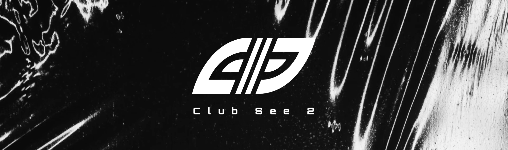

# SEE2-LINK

:globe_with_meridians: Official website: [Website](https://see2.club) 
:question: REM site: [REM](https://www.see2.club/rem) 
:books: Our information: [Information](https://info.see2.club)
:movie_camera: https://www.youtube.com/@ClubSee2

## See2-Link

:microscope: Your Ultimate Web 3.0 linktree: [See2-Link](https://see2.link) 
:computer: Read through the source code: [Main Repository](https://github.com/see2-club/Link) 

## See2-Life

:microscope: Your Ultimate Web 3.0 life-style: [See2-Life](https://life.see2.club) 
:computer: Read through the source code: [Main Repository](https://github.com/see2-club/see2Life) 

## See2-club

Club See2 is a cutting-edge web 3.0 designer collective with a visionary goal: to explore the fusion of interaction and fashion in the digital realm.

Our mission is to empower users across the globe to craft their virtual identities, seamlessly connect them to the ever-evolving Web 3.0 landscape, and ultimately guide their experiences back into the physical world.

We firmly believe that each individual's unique life journey is a priceless asset, and through our platform, we're pioneering a fresh narrative that ensures every user's story is truly and authentically witnessed.

